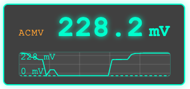

# OBS DMM Display

A desktop overlay app for reading measurements from a supported multimeter and displaying them as a transparent overlay for use with OBS or as a standalone window.



## Current status

### UT161B

- Uses HID USB communication.
- The current implementation sends initialization requests and then polls for live measurement packets.

### UT8802E

- Verified working on real hardware.
- Uses the CP2110 USB/HID bridge directly via `hidapi`.
- If no compatible device is present, the app stays disconnected instead of crashing.
- A packet-hex fallback is also available for testing the parser without hardware.

### UT8803E (preview)

- Driver structure is implemented but not yet verified against real hardware.
- Uses the `pycp2110` library for CP2110 communication.
- A packet-hex fallback is available for testing the parser without hardware.

#### Capture logging (UT8802E / UT8803E)

Run the following command to log every raw frame's hex to a file:

```bash
DMM_8802E_CAPTURE_LOG=capture.log DMM_MODE=ut8802e python dmm.py
```

Each line shows the timestamp and the full frame hex, useful for diagnosing unknown mode codes or verifying parser behaviour against real hardware.

#### Optional test input (UT8802E / UT8803E)

If you have a packet captured from the instrument, you can feed it in as hex:

```bash
DMM_MODE=ut8802e DMM_8802E_PACKET_HEX=ac0304053031323300 python dmm.py
```

This is useful for validating the parsing logic without needing the device connected.

## Installation

1. Install the native HID library (required by both `pycp2110` and `hidapi`):
   - **Debian/Ubuntu:** `sudo apt install libhidapi-hidraw0`
   - **Fedora:** `sudo dnf install hidapi`
   - **Arch:** `sudo pacman -S hidapi`
   - **macOS:** `brew install hidapi`
   - **Windows:** no separate install needed — a prebuilt binary is bundled

2. Create and activate a virtual environment:

```bash
python3 -m venv .venv

# macOS/Linux
source .venv/bin/activate
# Windows (cmd)
.venv\Scripts\activate
# Windows (PowerShell)
.venv\Scripts\Activate.ps1
```

3. Install Python dependencies:

```bash
pip install -r requirements.txt
```

4. **Linux only:** the multimeter's USB device usually isn't accessible to a
   non-root user by default. Add a udev rule (see
   https://github.com/libusb/hidapi/blob/master/udev/) or run with `sudo`
   for testing.

## Running the app

Run the app with a single selected meter mode at startup:

- `DMM_MODE=ut161b python dmm.py`
- `DMM_MODE=ut8802e python dmm.py`
- `DMM_MODE=ut8803e python dmm.py`

The overlay window opens automatically.

## Building a standalone app

The app can be packaged into a standalone executable using PyInstaller. No Python installation required on the target machine.

> **Note:** builds are platform-specific. Run the build on the OS you want to target: macOS on a Mac, Windows on a Windows PC.

### Prerequisites

Install PyInstaller into your venv:

```bash
pip install pyinstaller
```

### macOS

```bash
pyinstaller \
  --name "OBS DMM Display" \
  --windowed \
  --icon=dmm.icns \
  --onefile \
  --collect-all webview \
  --add-data "templates:templates" \
  --add-data "drivers:drivers" \
  dmm.py
```

The built app appears at `dist/OBS DMM Display.app`.

### Windows (untested)

Run this in Command Prompt or PowerShell (not Git Bash):

```bat
pyinstaller ^
  --name "OBS DMM Display" ^
  --windowed ^
  --onefile ^
  --collect-all webview ^
  --add-data "templates;templates" ^
  --add-data "drivers;drivers" ^
  dmm.py
```

The built executable appears at `dist\OBS DMM Display.exe`.

> **Windows note:** pywebview on Windows requires Microsoft Edge WebView2, which ships with Windows 11 and most up-to-date Windows 10 installs. If a user gets an error about a missing WebView2 runtime, they can install it from [Microsoft's site](https://developer.microsoft.com/microsoft-edge/webview2/).

### Notes

- The `--windowed` flag suppresses the terminal/console window.
- The `--onefile` flag produces a single executable. Omit it if you prefer a folder-based dist (faster startup, easier to inspect).
- After building, test the executable on a clean machine or VM before distributing. pywebview occasionally needs a system library that isn't bundled automatically.

## OBS Setup

To use the overlay in OBS, use the pre-built app or run it from source. The window is transparent and frameless by design.

1. Launch the app (`DMM_MODE=... python dmm.py` or the built executable).
2. In OBS, add a **Window Capture** source and select the "OBS DMM Display" window.
3. Use a **Chroma Key** or **Color Key** filter if needed, though the window background is already transparent on supported platforms.

Alternatively, if you prefer a Browser Source:

1. Keep the app running. It also serves the overlay at `http://127.0.0.1:8080`.
2. In OBS, add a **Browser Source** pointed at `http://127.0.0.1:8080`.
3. Set **Width**/**Height** to 322 / 157.
4. Leave **"Shutdown source when not visible"** and **"Refresh browser when scene becomes active"** unchecked.

## Development

Run the tests with:

```bash
python -m unittest discover -s tests -v
```

## Acknowledgments

This project's architecture and parts of its code are adapted from:

- [mbraune/ut161b](https://github.com/mbraune/ut161b) (MIT License)
- [philpagel/ut8803e](https://github.com/philpagel/ut8803e) (BSD-3-Clause License)

See `LICENSE.md` for the full license texts.

Also thanks to [Mainboard Medic](https://www.youtube.com/@MainboardMedic) for testing and updating the ut8802e driver.
